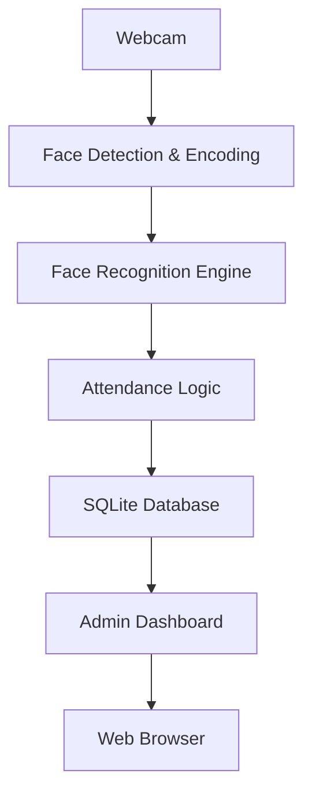
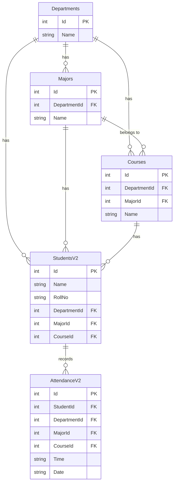

# Face Recognition–Based Attendance Management System

## Abstract

This project presents a web-based attendance management system that utilizes face recognition technology to automatically identify students and record attendance in real time. The system aims to reduce manual effort, minimize human error, and demonstrate the practical application of computer vision and machine learning techniques in an academic environment.

The implementation is based on Python and Flask, integrates classical face embedding–based recognition methods, and stores attendance data using a lightweight relational database. The project is intended strictly for academic experimentation, learning, and small-scale demonstrations.

---

## Objectives

The primary objectives of this project are:

1. To design and implement an automated attendance system using face recognition.
2. To apply computer vision techniques for real-time face detection and identification.
3. To develop a web-based administrative interface for managing student records.
4. To analyze the feasibility of deploying face recognition systems in educational contexts.

---

## System Overview

The system captures live video from a webcam, detects faces in real time, extracts facial embeddings, and compares them with stored embeddings generated from registered student images. When a match is identified, attendance is recorded automatically in the database.

---

## Key Features

- Automated face recognition–based attendance
- Real-time webcam-based face detection
- **Hierarchical organization: School → Major → Course**
- Student record management (add, update, delete)
- Training image dataset management
- Attendance report generation and CSV export
- PDF reports with School/Major/Course filtering
- **📊 Attendance Statistics & Analytics**
  - Interactive attendance rate charts with color-coded performance
  - Filter statistics by School, Major, and Course
  - Visual performance indicators (Excellent ≥80%, Good 60-80%, Need Improvement <60%)
  - Downloadable charts and detailed attendance breakdown
  - Real-time summary cards showing key metrics
- Admin authentication system
- Web-based dashboard interface

---

## Technology Stack

### Backend
- Python
- Flask

### Face Recognition & Image Processing
- face-recognition
- dlib
- OpenCV
- NumPy
- Pillow (PIL)

### Database
- SQLite

### Frontend
- HTML
- CSS
- JavaScript
- Bootstrap
- **Matplotlib** for attendance statistics charts

---

## System Architecture

### High-Level Architecture



### Data Model



---

## Installation & Setup

### Prerequisites

- Python 3.8 or higher
- pip (Python package manager)
- A webcam (for face recognition)

### Step 1: Clone the Repository

```bash
git clone https://github.com/Shudipto-creator/face-recognition-attendance-management-system.git
cd face-recognition-attendance-management-system
```

### Step 2: Create a Virtual Environment (Recommended)

```bash
python -m venv venv
# On Windows
venv\Scripts\activate
# On macOS/Linux
source venv/bin/activate
```

### Step 3: Install Dependencies

```bash
pip install -r requirements.txt
```

If `requirements.txt` doesn't exist, install the core packages manually:

```bash
pip install flask face-recognition opencv-python numpy pillow
```

### Step 4: Run the Application

```bash
python app.py
```

The application will start on `http://localhost:5000` by default.

---

## Usage Guide

### 1. Admin Login

- Navigate to the application URL
- Click on "Admin Login"
- Use the default credentials (check `app.py` for admin credentials)

### 2. Setup Schools, Majors, and Courses

1. From the dashboard, click "Manage Schools, Majors & Courses"
2. **Create Schools** (e.g., CSE, EEE, Business)
3. **Create Majors** under each School (e.g., Computer Science under CSE)
4. **Create Courses** under each Major (e.g., Data Structures under Computer Science)

### 3. Register Students

1. Click "Register New Student"
2. Select **School → Major → Course**
3. Enter student name and registration ID
4. Capture the student's photo using the webcam
5. Submit to register

### 4. Mark Attendance

1. From the home page, select **School → Major → Course**
2. Click "Punch your Attendance"
3. The system will use face recognition to identify students
4. Attendance is automatically recorded

### 5. View Reports

- **Today's Attendance**: View and filter today's attendance by School/Major/Course
- **Whole Database**: View complete attendance history
- **📊 Attendance Statistics**: 
  - Interactive charts showing attendance rates with color coding
  - Filter statistics by School, Major, and Course
  - Performance indicators (Excellent ≥80%, Good 60-80%, Need Improvement <60%)
  - Download charts as PNG files
  - Detailed student-by-student attendance breakdown
- **PDF Export**: Download filtered attendance reports as PDF

---

## 📊 Attendance Statistics Features

The system includes comprehensive attendance analytics with the following capabilities:

### Interactive Charts
- **Attendance Rate Bar Charts**: Visual representation of student attendance percentages
- **Color-Coded Performance**:
  - 🟢 **Excellent (≥80%)**: Green bars for high performers
  - 🟡 **Good (60-80%)**: Orange bars for satisfactory performance
  - 🔴 **Need Improvement (<60%)**: Red bars for low attendance
- **Reference Lines**: Visual thresholds at 60% and 80% for quick assessment
- **Downloadable Charts**: Export charts as PNG files for reports

### Advanced Filtering
- **Multi-Level Filtering**: Filter by School → Major → Course hierarchy
- **Real-Time Updates**: Charts and statistics update instantly when filters change
- **Combined Filters**: Apply multiple filters simultaneously for precise analysis

### Statistical Summaries
- **Total Students**: Number of students in filtered dataset
- **Total Days**: Number of attendance days recorded
- **Performance Counters**: 
  - Count of students with Excellent attendance (≥80%)
  - Count of students needing improvement (<60%)
- **Individual Breakdown**: Detailed table showing each student's attendance rate

### Technical Implementation
- **Dynamic Chart Generation**: Uses Matplotlib for server-side chart creation
- **Responsive Design**: Mobile-friendly interface with modern UI
- **Auto-Refresh**: Charts automatically refresh every 30 seconds
- **Error Handling**: Graceful handling of missing data or loading errors

### Access Routes
- `/statistics` - Main statistics page with filters and charts
- '/generate-chart-rate-filtered' - API endpoint for filtered chart generation

---

## Directory Structure

```
face-recognition-attendance-management-system/
├── app.py                 # Main Flask application
├── information.db         # SQLite database
├── Training images/       # Student training images
├── attendance.csv         # Attendance export file
├── cred.csv              # Credentials file
├── templates/             # HTML templates
│   ├── main.html         # Home page
│   ├── new.html          # Student registration
│   ├── form2.html        # Today's attendance
│   ├── form3.html        # Whole database view
│   ├── statistics.html   # 📊 Attendance statistics page
│   ├── catalog.html      # Schools/Majors/Courses management
│   └── ...               # Other templates
├── static/               # Static assets (CSS, JS)
└── README.md             # This file
```

---

## Configuration

### Database

The system uses SQLite (`information.db`). The database is automatically created and migrated on first run.

### Face Recognition Settings

- Face recognition tolerance can be adjusted in `app.py`
- Training images are stored in the `Training images/` directory
- Images are organized by School and Major for better organization

---

## Troubleshooting

### Common Issues

1. **Camera not detected**: Ensure your webcam is properly connected and not used by other applications
2. **Face recognition not working**: Ensure proper lighting and face positioning during registration
3. **Database errors**: Delete `information.db` and restart the application to recreate the database

### Performance Tips

- Use good lighting for better face recognition accuracy
- Ensure training images are clear and capture different angles
- Regularly clean up old attendance records to maintain performance

---

## Security Considerations

- This system is designed for academic/demonstration purposes only
- Store training images securely
- Regular backup of the database is recommended
- Consider implementing additional authentication mechanisms for production use

---

## Contributing

1. Fork the repository
2. Create a feature branch
3. Make your changes
4. Test thoroughly
5. Submit a pull request

---

## License

This project is for educational purposes. Please check the repository for specific licensing information.

---

## Acknowledgments

- OpenCV community for computer vision resources
- face-recognition library developers
- Flask framework contributors
- Bootstrap for UI components
